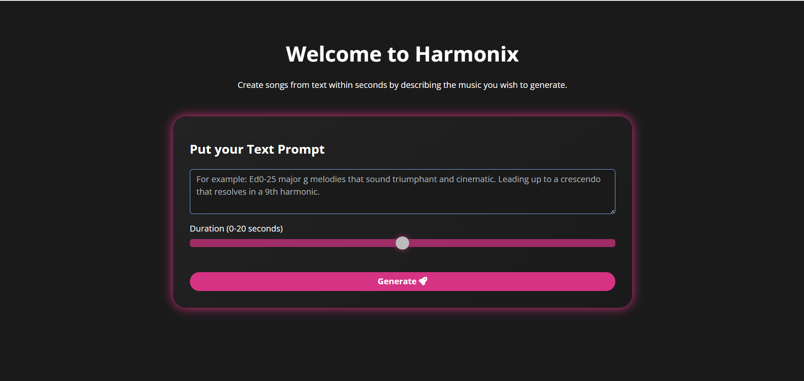
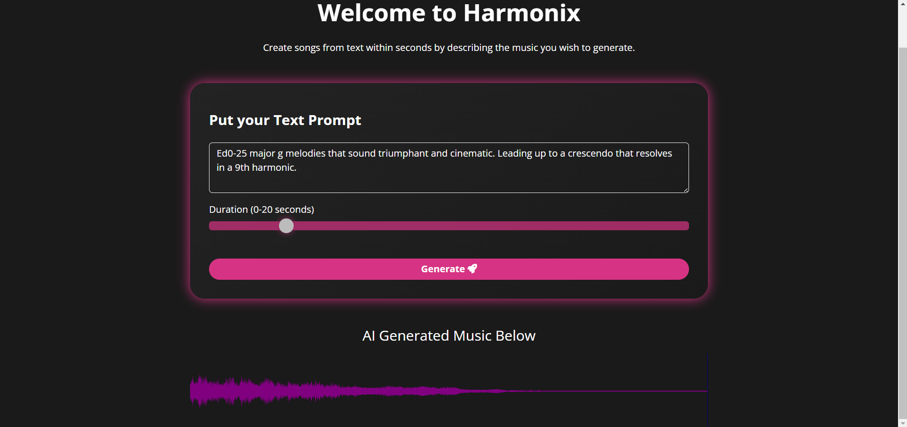

# Harmonix - AI Music Generation

A web application that generates music from text descriptions using Facebook's MusicGen model, Transformers, and PyTorch. This project provides an intuitive interface for creating custom music sequences based on textual prompts.

## Screenshots

### Application Interface


### Generated Music Waveform


## Features

- Text-to-music generation using MusicGen Large model
- Interactive web interface with duration control
- Real-time waveform visualization
- Audio playback controls
- Modern, responsive design with dark theme

## Getting Started

1. **Clone the Repository**
   ```bash
   git clone https://github.com/BlakeAmory/Harmonix_AI_music_generation.git
   cd Harmonix_AI_music_generation
   ```

2. **Install Dependencies**
   ```bash
   pip install -r requirements.txt
   ```
   Required packages include FastAPI, PyTorch, Transformers, and other dependencies listed in requirements.txt.

3. **Run the Application**
   ```bash
   uvicorn app:app --host 0.0.0.0 --port 8000
   ```
   Access the web interface at http://localhost:8000

## Usage

1. Enter a descriptive prompt for your desired music (e.g., "Ed0-25 major g melodies that sound triumphant and cinematic")
2. Adjust the duration slider (0-20 seconds)
3. Click "Generate" and wait for your custom music to be created
4. Play the generated music with the interactive waveform visualizer

## Technical Details

- Backend: FastAPI with Python
- AI Model: facebook/musicgen-large
- Frontend: HTML5, CSS3, JavaScript with WaveSurfer.js
- Audio Processing: scipy.io.wavfile

## License

Distributed under the MIT License. See `LICENSE` for more information.

---

#### If you find this project helpful, please consider giving it a ⭐
